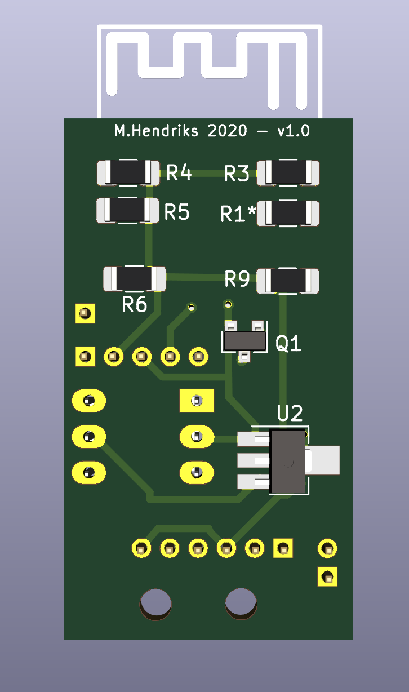

# DSMR-API
Er zijn al veel DSMR-API/ Slimmemeter / P1 oplossingen in omloop. Toch heb ik besloten om er nog eentje aan toe te voegen omdat veel van de oplossingen niet voldeden aan mijn wensen. Gedachte was de volgende :
- geen voeding nodig (komt uit de slimmemeter)
- meest compacte vorm
- budgetvriendelijk en gebruik maken van een ESP8266/8285 oplossing

## OPLOSSING
Uiteindelijk gekozen voor een ESP-M3 (ESP8285) aangevuld met enkele nog met de hand te solderen SMD componenten.
Op het printje zitten de volgende modules:
- signaal inverter om het P1 signaal te inverteren
- optocoupler voor het aansturen van de P1 (data request)
- spanningsregulator voor het naar 3.3Volt brengen van de P1 spanning.
- de ESP-M3 natuurlijk

Alle modules samen zie je hieronder.
 

Omgezet naar een board ziet dit er zo uit:
  

## SOFTWARE
Er is veel software online te vinden. Keuze voor de gebruiker vind ik belangrijk daarom gekozen voor twee scenario's, namelijk:
- Tasmota Out of the box (MQTT)
- Json API + User interface (Willem AandeWiel oplossing)

Zelf ben ik een groot fan van de Tasmota software voor de ESP8266 familie. Deze is dan ook als eerste gebruikt om de oplossing werkend te krijgen. Tasmota kan out of the box op de module geflasht worden. Instructie is te vinden in de Tasmota folder.

Veel dank aan Willem AandeWiel voor zijn oplossing. Deze oplossing is als basis genomen en diverse veranderingen aan doorgevoerd. Oplossing van Willem is gemaakt voor een 4MB esp module en de M3 heeft er maar 1. Meer dan genoeg als alle extra functionaliteit verwijderd wordt en de overige compacter wordt gemaakt.
Aanpassingen zijn:
- omdat de ESP-M3 geen secundaire seriele interface heeft die te gebruiken is is er een software oplossing gebruikt (met dank aan Tasmota); In de basis is de oplossing van Willem te gebruiken met een kleine aanpassing voor deze seriele interface.
- alle statische pagina's komen uit een CDN (esp modules hebben maar een beperkte capaciteit en zijn geen hele goede webservers;)
- alle plaatjes zijn nu iconen geworden
- files zijn omgezet naar Json zodat dit makkelijk te onderhouden is en compacter wordt
- json API communicatie is ook gewijzigd (compacter en als een burst ipv gesegmenteerd)
- opmaak is zo veel als mogelijk uit de html / js files gehaald en in de css gestopt (overigens nog niet af)